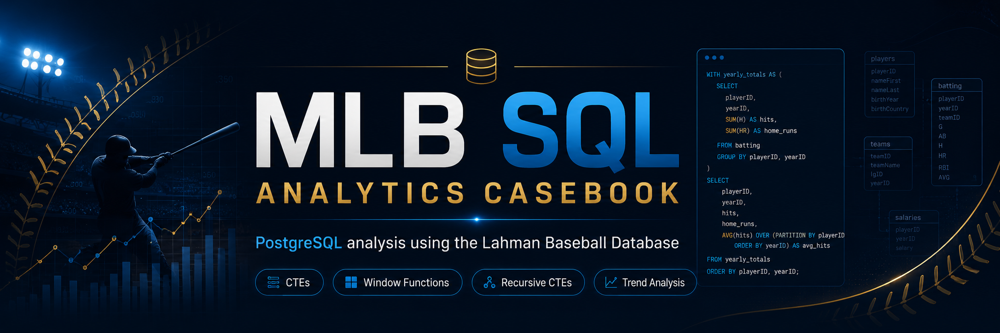
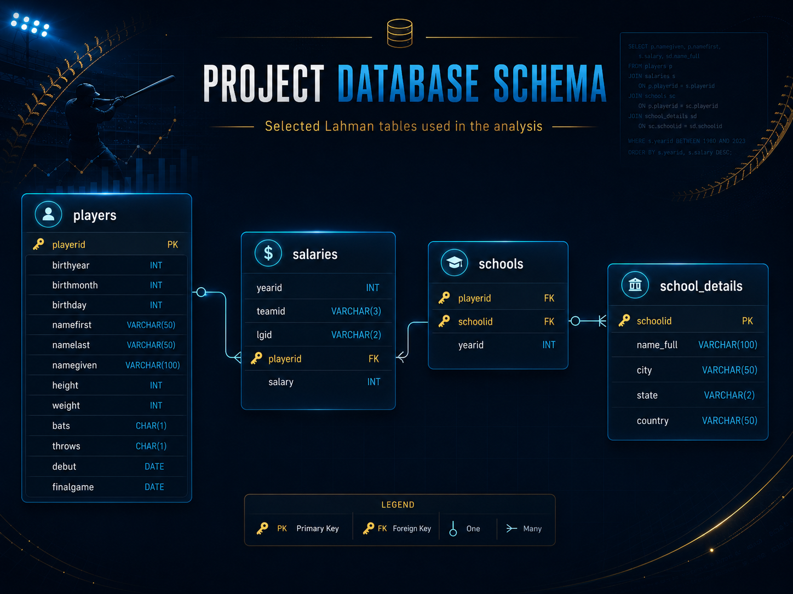

# MLB SQL Analytics Casebook




## Overview

**MLB SQL Analytics Casebook** is a polished SQL portfolio project built around historical Major League Baseball data from the Lahman Baseball Database.

The project analyzes player schools, team salary spending, player career timelines, and player attributes using PostgreSQL. The goal is not only to write SQL queries, but to show how SQL can be used to answer business-style analytical questions, structure a reproducible project, and communicate results clearly.

This repository presents SQL as a practical analytics tool for:

* historical trend analysis
* sports analytics
* payroll and cumulative spending analysis
* career lifecycle analysis
* player attribute comparison
* data storytelling through structured case notes and results

---

## Project Purpose

Real analytics work is rarely just about writing one query.

The challenge is usually understanding the question, identifying the right tables, building the correct logic, validating the output, and explaining what the result actually means.

This project demonstrates that process through a sports analytics casebook.

Each analysis shows how I:

* translate business-style questions into SQL queries
* inspect and use relational database tables
* aggregate data across years, teams, schools, and players
* use CTEs and window functions to build multi-step analysis
* calculate running totals and decade-over-decade changes
* summarize findings in clean result files
* document the logic behind each analysis clearly

---

## Database Schema



This project uses selected Lahman Baseball Database tables needed for the analysis.

| Table            | Purpose                                                                                                           |
| ---------------- | ----------------------------------------------------------------------------------------------------------------- |
| `players`        | Player biographical details, birth dates, debut/final game dates, height, weight, batting side, and throwing hand |
| `salaries`       | Player salary records by year and team                                                                            |
| `schools`        | Player-school-year relationships                                                                                  |
| `school_details` | School names and location metadata                                                                                |

---

## Case Index

| Case | Analysis Area                 | Main Question                                                                                       | Main SQL Concepts                                           |
| ---: | ----------------------------- | --------------------------------------------------------------------------------------------------- | ----------------------------------------------------------- |
|   01 | School Pipeline Analysis      | What schools do MLB players attend, and how did school pipelines change over time?                  | Recursive CTEs, aggregation, ranking, joins                 |
|   02 | Team Salary Spending Analysis | How much do teams spend on player salaries, and when did cumulative spending pass major milestones? | CTEs, window functions, cumulative sums, threshold analysis |
|   03 | Player Career Analysis        | What does each player's career look like from debut to final game?                                  | Date logic, age calculation, joins, career span analysis    |
|   04 | Player Attribute Comparison   | How do player birthdays, batting sides, height, and weight compare across players and decades?      | Self joins, conditional aggregation, percentages, `LAG()`   |

---

## Repository Structure

```text
mlb-sql-analytics-casebook/
│
├── .gitignore
├── LICENSE
├── README.md
├── DATA_LICENSE.md
│
├── assets
│   ├── repo-banner.png
│   └── schema.png
│
├── database
│   └── create_lahman_mlb_database.sql
│
├── queries
│   ├── 01_school_pipeline_analysis.sql
│   ├── 02_team_salary_spending_analysis.sql
│   ├── 03_player_career_analysis.sql
│   └── 04_player_attribute_comparison.sql
│
├── case-notes
│   ├── 01_school_pipeline_analysis.md
│   ├── 02_team_salary_spending_analysis.md
│   ├── 03_player_career_analysis.md
│   └── 04_player_attribute_comparison.md
│
└── results
    ├── 01_school_pipeline_results.md
    ├── 02_team_salary_results.md
    ├── 03_player_career_results.md
    └── 04_player_attribute_results.md
```

---

## What Each Folder Contains

```text
database/
```

Contains the PostgreSQL setup script used to create and populate the required project tables.

```text
queries/
```

Contains the clean SQL analysis files. Each file answers one major analysis area and is organized by question.

```text
case-notes/
```

Contains the reasoning behind each analysis, including the business framing, SQL approach, concepts used, and interpretation guide.

```text
results/
```

Contains the documented outputs and insights from each query file.

```text
assets/
```

Contains the visual assets used in this README, including the repository banner and database schema diagram.

---

## Analysis Workflow

Each case follows a structured analytics process:

```text
Read the business question
        ↓
Identify the relevant tables
        ↓
Build the SQL logic using CTEs, joins, and aggregations
        ↓
Run the query in PostgreSQL
        ↓
Review and validate the output
        ↓
Summarize the result in plain English
        ↓
Document the insight in the results file
```

This mirrors a real analytics workflow: start with a question, understand the data, build the query, validate the result, and communicate the finding clearly.

---

## Case 01 — School Pipeline Analysis

The first case analyzes which schools produced MLB players and how those school pipelines changed over time.

This case answers:

* In each decade, how many schools produced MLB players?
* Which schools produced the most players overall?
* Which schools were the top producers in each decade?

Key findings include:

* MLB school-linked player production increased sharply in the modern era.
* The strongest decades in the output were 1984-1993, 1994-2003, and 1974-1983.
* The top overall schools included the University of Texas at Austin, University of Southern California, Arizona State University, Stanford University, and University of Michigan.
* The top schools changed across eras, showing that MLB talent pipelines shifted over time.

Main SQL concepts:

* recursive CTEs
* decade bucketing
* `COUNT(DISTINCT ...)`
* ranking with window functions
* joins to lookup tables

Files:

```text
queries/01_school_pipeline_analysis.sql
case-notes/01_school_pipeline_analysis.md
results/01_school_pipeline_results.md
```

---

## Case 02 — Team Salary Spending Analysis

The second case analyzes MLB payroll spending by team.

This case answers:

* Which teams appear among the highest salary spenders?
* How does each team's cumulative payroll change over time?
* When did each team first surpass $1 billion in cumulative spending?

Key findings include:

* The New York Yankees appear repeatedly among the highest payroll team-years.
* The Los Angeles Dodgers, Philadelphia Phillies, and Boston Red Sox also appear strongly in the highest-spending group.
* The Yankees were the first team in the output to surpass $1 billion in cumulative recorded salary spending.
* Cumulative payroll gives a clearer view of long-term team investment than annual spending alone.

Main SQL concepts:

* grouped aggregation
* average annual spending
* window functions
* cumulative sums
* threshold filtering
* milestone analysis

Files:

```text
queries/02_team_salary_spending_analysis.sql
case-notes/02_team_salary_spending_analysis.md
results/02_team_salary_results.md
```

---

## Case 03 — Player Career Analysis

The third case analyzes player career timelines.

This case answers:

* How old was each player at their first game?
* How old was each player at their last game?
* How long was each player's career?
* What team did each player start and end with?
* How many players started and ended on the same team while playing for more than a decade?

Key findings include:

* The longest careers in the output span more than 25 years.
* The top career length in the sample is 35 years.
* Some players started and ended with the same team, while many others moved teams across their careers.
* 19 players started and ended on the same team while also playing for more than a decade.

Main SQL concepts:

* date construction with `MAKE_DATE`
* age calculation with `AGE`
* extracting years from dates
* joining player records to salary/team records
* career span calculation
* conditional aggregation

Files:

```text
queries/03_player_career_analysis.sql
case-notes/03_player_career_analysis.md
results/03_player_career_results.md
```

---

## Case 04 — Player Attribute Comparison

The fourth case compares player attributes and tracks physical trends over time.

This case answers:

* Which players have the same birthday?
* For each team, what percentage of players bat right, left, and both?
* How have average height and weight at debut changed by decade?

Key findings include:

* A self join can identify player pairs with the same birthdate.
* Right-handed batters make up the largest share for every team shown in the sample.
* Average player weight increased substantially over time.
* Average player height also increased over time.
* The largest weight jump in the output occurred between 1991-2000 and 2001-2010.

Main SQL concepts:

* self joins
* pairwise comparison
* conditional aggregation
* percentage calculations
* recursive CTEs
* decade grouping
* `LAG()` for decade-over-decade differences

Files:

```text
queries/04_player_attribute_comparison.sql
case-notes/04_player_attribute_comparison.md
results/04_player_attribute_results.md
```

---

## How to Run This Project

This project is designed to be run locally in PostgreSQL using pgAdmin.

### Step 1 — Create a Database

Open pgAdmin and create a new PostgreSQL database manually.

Example database name:

```text
mlb_sql_analytics
```

### Step 2 — Run the Database Setup Script

Open the following file:

```text
database/create_lahman_mlb_database.sql
```

Run the full script inside your new PostgreSQL database.

This script creates and populates the tables required for the analysis.

### Step 3 — Run the Analysis Queries

Run the SQL files in the `queries/` folder:

```text
queries/01_school_pipeline_analysis.sql
queries/02_team_salary_spending_analysis.sql
queries/03_player_career_analysis.sql
queries/04_player_attribute_comparison.sql
```

### Step 4 — Review the Documentation

For each analysis, review the matching notes and results:

```text
case-notes/
results/
```

The case notes explain the analytical approach.
The results files summarize the outputs and key insights.

---

## SQL Skills Demonstrated

This repository demonstrates practical SQL skills including:

* `SELECT` queries
* filtering with `WHERE`
* joins across relational tables
* grouped aggregation with `GROUP BY`
* distinct counting with `COUNT(DISTINCT ...)`
* conditional aggregation with `CASE WHEN`
* recursive CTEs
* multi-step CTE workflows
* window functions
* `ROW_NUMBER()`
* `NTILE()`
* `LAG()`
* cumulative sums with `SUM() OVER (...)`
* date construction with `MAKE_DATE`
* age calculations with `AGE`
* percentage calculations
* threshold-based filtering
* ordered analytical reporting

---

## Analytical Skills Demonstrated

Beyond SQL syntax, this project highlights analytical thinking skills including:

* translating business questions into SQL logic
* choosing the correct level of aggregation
* comparing results across decades
* identifying top performers and outliers
* building cumulative metrics
* interpreting trends over time
* validating outputs with sample results
* communicating technical findings clearly
* documenting analysis in a recruiter-friendly format

---

## Documentation Skills Demonstrated

This project also demonstrates technical documentation through:

* a structured README
* organized SQL files
* separate case notes
* separate results summaries
* visual schema documentation
* clear folder organization
* data license attribution
* reproducible setup instructions

---

## Tools and Technologies

* PostgreSQL
* pgAdmin
* SQL
* Markdown
* GitHub
* Lahman Baseball Database
* Relational database analysis
* Schema documentation

---

## Portfolio Value

This repository is designed as a data portfolio project for roles involving:

* data analysis
* business analytics
* business intelligence
* analytics engineering
* reporting automation
* SQL development
* sports analytics
* data storytelling

It demonstrates the ability to move beyond basic query writing and use SQL to answer structured analytical questions, produce clean outputs, and explain insights clearly.

---

## Data Source and Attribution

This project uses selected tables from the Lahman Baseball Database.

The original data is credited to Sean Lahman and is made available through SABR. The Lahman data is licensed under the Creative Commons Attribution-ShareAlike 3.0 Unported License.

See:

```text
DATA_LICENSE.md
```

for full data attribution and license details.

---

## Project Goals

The goals of this project are to:

* practice advanced SQL using a real historical dataset
* build a polished SQL portfolio project
* analyze baseball data through business-style questions
* demonstrate SQL skills beyond basic querying
* document query logic and results professionally
* create a reproducible PostgreSQL analysis casebook

---

## 🧑‍💻 Author

**Adham Elkhouly**

- Reporting & Analytics Specialist @ Nestlé
- Microsoft Power Platform Functional Consultant Associate

This repository was created as a portfolio project to demonstrate SQL investigation skills, structured problem-solving, and clear technical documentation.

---

## License

This project will be licensed under the license included in the repository.

See the `LICENSE` file for details.

The Lahman Baseball Database data used in this project is covered separately under the terms described in `DATA_LICENSE.md`.
